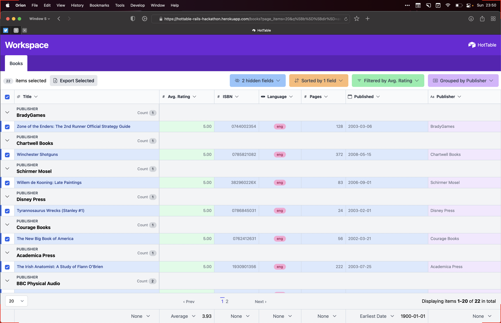
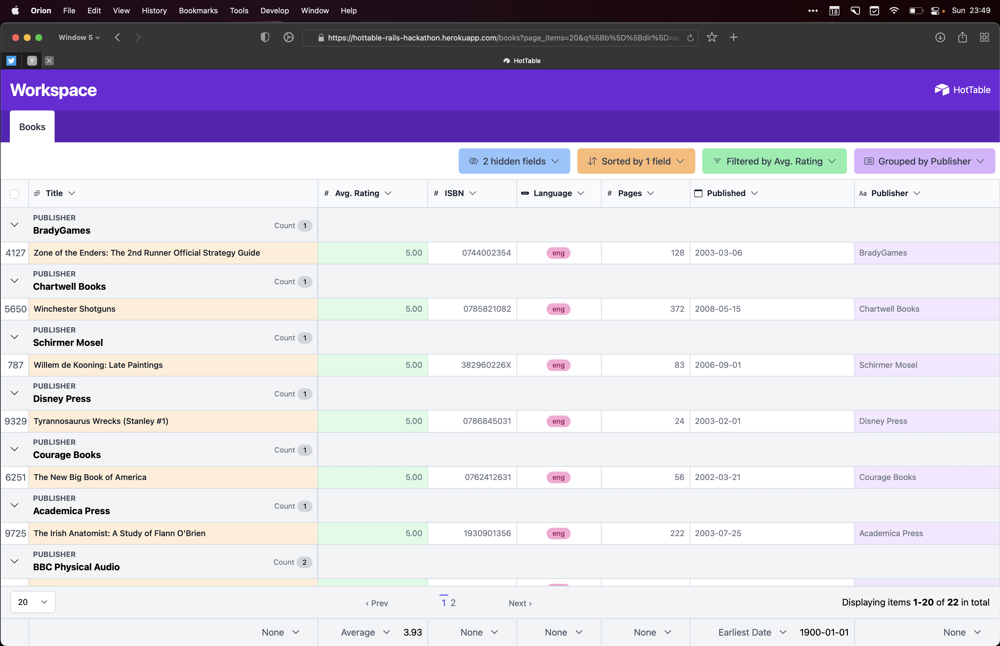
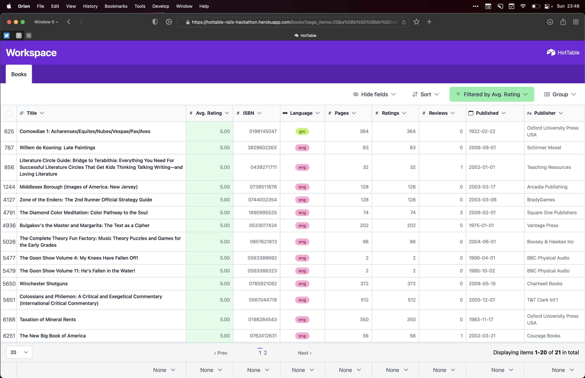
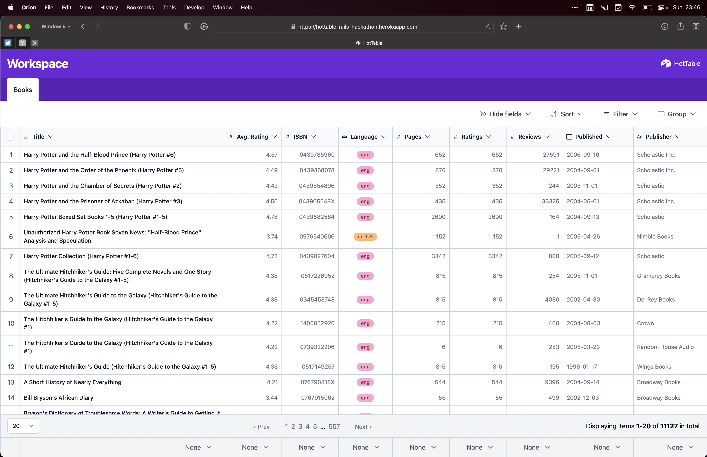
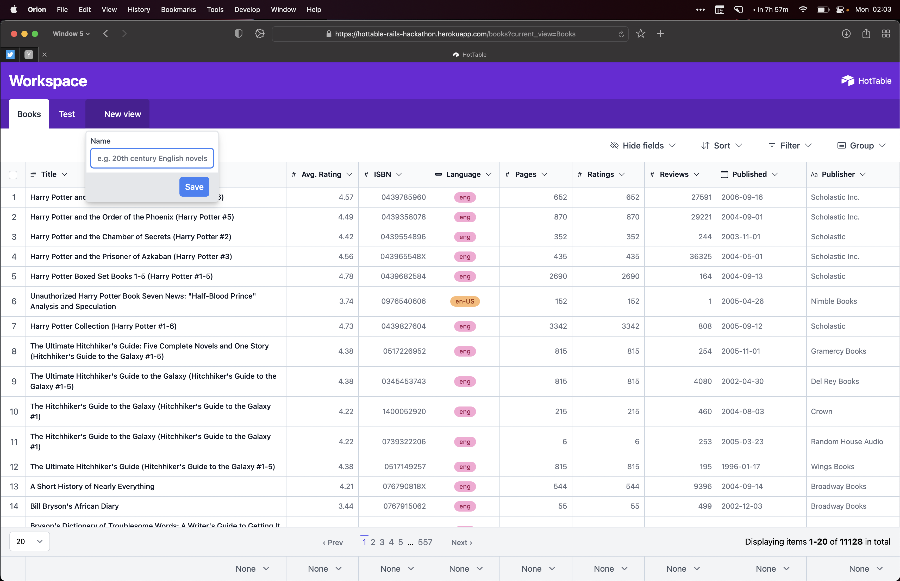
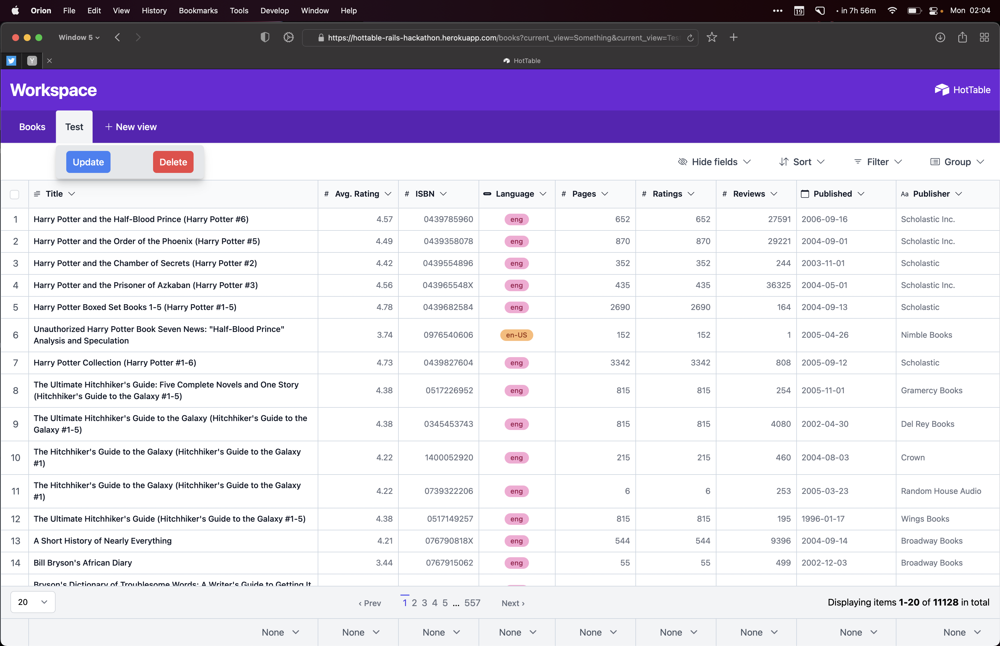
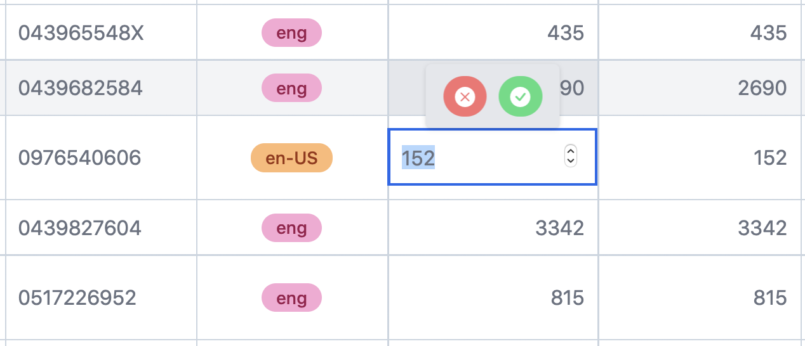

# HotTable

This application was built during the [Rails Hackathon](https://railshackathon.com) 2022. A remote hackathon for Rails developers.
We had 48 hours to build a Ruby on Rails application with the theme: **[Hotwire](https://hotwired.dev) powered Rails apps**.

## Team

* [Stephen Margheim](https://github.com/fractaledmind)
* [Joel Drapper](https://github.com/joeldrapper)
* [Marco Roth](https://github.com/marcoroth)

On the Rails Hackathon site: https://railshackathon.com/teams/18

## Description

This is an (minimal) [Airtable](https://airtable.com) clone. We left out any of the schema-building functionality and focused squarely on the data management functionality. Moreover, we pushed hard on using semantic HTML, so the table is an actual `<table>`. Within the space of data management, there are a surprising number of features however:

* Manage which fields are displayed
* Sort by any field in either direction (with multi-column sorting supported as well)
* Filter by any complex query you can imagine (nested ANDs and ORs supported with a full range of predicates)
* Group by any field (sorting in either direction, collapsing or expanding the grouped rows)
* Select rows (with clear visual indication of selected rows)
* Select all rows in the dataset (with clear visual indication of how many records are selected)
* Bulk export selected rows (with whatever display/sort/filter conditions are set on the view)
* Full pagination functionality (select number of items displayed per page, jump to a specific page, see the details of the pagination window)
* Column summaries (see information about the dataset for particular columns, with calculations based on the data-type of the column)
* X- and Y-axis scrollable table on overflow, with fixed headers, footers, and primary columns
* Quick sort, group, hide options for each column in a column header dropdown
* Inline editing of all table cells
* CRUD of views, saving your configuration of a particular combination of fields, sorts, filters, grouping, and pagination

## Built with

* [Ransack](https://activerecord-hackery.github.io/ransack/) drives the filtering and sorting. We extended Ransack to drive the fields and grouping.
* [Pagy](https://ddnexus.github.io/pagy/) drives the pagination. We applied Tailwind styling to the generated HTML.
* [Stimulus](https://stimulus.hotwired.dev/) drives the "details set" (only one `
` element open at a time), automatic form submission of pagination items, building complex sorts/filters, etc.
* [Turbo Drive](https://turbo.hotwired.dev/handbook/drive) allows all of the "searching" to run without a mess of updating dozens of parts of the page on any change.
* [Turbo Streams](https://turbo.hotwired.dev/handbook/streams) drive the column calculations and inline editing to allow for atomic updates of individual table cells.
* [TurboPower](https://github.com/marcoroth/turbo_power) adds a bunch of additional Turbo Stream actions and drives key parts of the inline editing flow.
* [Phlex](https://phlex.fun/) replaces `ActionView` for the HTML rendering, allowing us to build layouts, pages, and components all in pure Ruby.
* [TailwindCSS](https://tailwindcss.com/) for styling

## Demo

A demo application is running at [http://hottable-rails-hackathon.herokuapp.com](http://hottable-rails-hackathon.herokuapp.com)

## Entry

Our entry on the Rails Hackathon site: https://railshackathon.com/entries/6

## Application Screenshots

